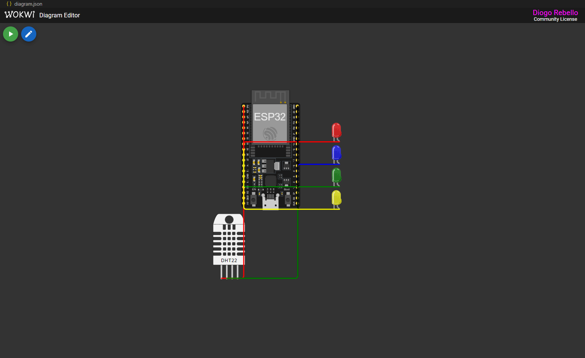

# 🌿 Construindo Máquina Agrícola Inteligente

Projeto acadêmico dividido em duas fases principais: **coleta de dados ambientais com ESP32** e **armazenamento/processamento via API Flask com banco SQL**. O objetivo é aplicar conceitos de automação, IoT e persistência de dados para ambientes agrícolas.

---

## 📁 Estrutura do Repositório

```
construindo_maquina_agricola/
├── sensores/
│   ├── main.ino
│   └── simulacao_esp32.png
│
├── api_crud/
│   ├── app.py
│   └── requirements.txt
│
├── dashboard/
│   ├── app.py
│   └── requirements.txt
│
├── .gitignore
└── README.md
```

### 📌 Descrição das Pastas e Arquivos

- `sensores/`: Projeto da Fase 1, com o código C/C++ do ESP32 e imagem do circuito Wokwi.
- `api_crud/`: Projeto da Fase 2, com a API Flask documentada com Swagger.
- `dashboard/`: Projeto “Ir Além”, com dashboard interativo em Streamlit.
- `main.ino`: Código-fonte responsável pela leitura dos sensores e envio dos dados via HTTP.
- `simulacao_esp32.png`: Imagem ilustrativa da montagem simulada no Wokwi.
- `app.py`: Código principal da API ou dashboard, dependendo da pasta.
- `requirements.txt`: Dependências de cada módulo.
- `.gitignore`: Arquivos e pastas ignorados pelo Git.
- `README.md`: Este documento com explicações completas do projeto.

---

## 🚀 Entrega 1: Sistema de Sensores e Controle com ESP32

Nesta primeira fase, desenvolvemos um sistema de monitoramento e automação para plantio inteligente utilizando o ESP32 e sensores simulados.

### ✅ Metas:

- Construção do circuito de sensores no [Wokwi](https://wokwi.com/)
- Código em C/C++ utilizando PlatformIO
- Acionamento automático de um relé (bomba de irrigação)
- Comentários no código explicando a lógica
- Registro e documentação da montagem no README

### 🔌 Componentes simulados:

- Sensor de umidade
- Sensor de pH
- Relé de irrigação
- ESP32 DevKit v1

### 🖼️ Circuito no Wokwi:



### 📂 Entregáveis:

- `main.ino` com o código completo e comentado
- `simulacao_esp32.png` com a imagem do circuito
- Documentação explicando o funcionamento

---

## 💾 Entrega 2: Armazenamento de Dados em Banco SQL com Python

A segunda fase consiste em simular o envio dos dados dos sensores para um sistema de banco de dados por meio de uma API RESTful em Python com Flask.

### ✅ Metas:

- Captura de dados do ESP32 por requisições HTTP
- API Flask conectada a um banco MySQL
- CRUD completo: inserção, consulta, atualização e exclusão
- Justificativa das tabelas utilizadas com base no MER da Fase 2
- Documentação com exemplos e justificativas

### 📘 Endpoints disponíveis:

- `/produtores` - Cadastro de produtores
- `/culturas` - Gestão das culturas agrícolas
- `/sensores` - Cadastro dos sensores físicos
- `/sensores-instalados` - Associação de sensores a culturas
- `/leituras` - Registro das leituras de sensores

### 🔍 Documentação Swagger

Acesse a documentação interativa da API em:

👉 http://{base_url_api}:5000/apidocs

### 📂 Entregáveis:

- `app.py` com a API Flask completa
- `requirements.txt` com dependências
- Swagger UI embutido na aplicação para testes dos endpoints
- Tabelas com dados fictícios para simulação

---

## 🌟 Projeto “Ir Além” – Dashboard Interativo com Streamlit

Como parte das atividades opcionais da disciplina, este projeto também inclui um dashboard interativo que permite visualizar em tempo real os dados coletados pelos sensores instalados em campo.

### 🎯 Objetivo

Transformar dados técnicos em representações visuais fáceis de entender, possibilitando que qualquer usuário — mesmo sem conhecimento técnico — possa acompanhar:

- Umidade do solo
- pH
- Níveis de fósforo e potássio
- Nome dos sensores e seus valores ao longo do tempo

### 🧰 Tecnologias Utilizadas

- **Python**
- **Streamlit** (aplicação web interativa)
- **Pandas** (manipulação de dados)
- **Plotly** (visualização gráfica)
- **Integração com API Flask (Fase 2)**

### 🖥️ Funcionalidades do Painel

- Gráficos por sensor com separação por cor
- Tabela de dados com nomes reais dos sensores
- Atualização em tempo real dos dados com base na API
- Interface simples acessível via navegador

### ▶️ Como Executar

```bash
cd dashboard
pip install -r requirements.txt
streamlit run app.py
```

Depois disso, acesse o painel em: [http://localhost:8501](http://localhost:8501)

### 📂 Entregáveis

- `dashboard/app.py`: Código completo do painel
- `dashboard/requirements.txt`: Dependências necessárias
- Atualização automática com base na API desenvolvida

---

## 📊 Justificativa Técnica

- A estrutura de banco foi modelada com base em entidades do MER proposto na Fase 2, permitindo normalização dos dados e rastreabilidade por produtor, cultura, sensor e leitura.
- Os sensores simulam dados relevantes para tomada de decisão em sistemas de irrigação automatizados.
- A API oferece pontos de integração para aplicações futuras, como dashboards ou automações.

---

## 📜 Licença

Distribuído sob a licença MIT. Veja `LICENSE` para mais informações.
